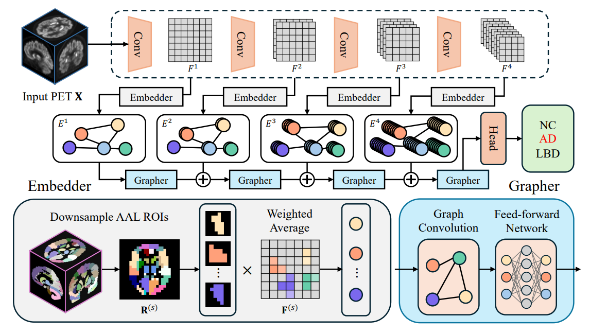

# PRGNN: Pyramidal Region Graph Neural Network for Region-Based Brain PET Classification

<p align="center">
  
</p>

This is the official implementation of the paper:

**PRGNN: Pyramidal Region Graph Neural Network for Region-Based Brain PET Classification**
Daesung Kim, Seungbeom Seo, Boosung Kim, Kyobin Choo, Youngjun Jun, Mijin Yun

Accepted at **MICCAI 2025** | [Paper](https://papers.miccai.org/miccai-2025/paper/0340_paper.pdf) | [SpringerLink](https://rdcu.be/eHc7l)

## Abstract

Brain positron emission tomography (PET) has been widely used for the diagnosis of various neurodegenerative diseases. To assist physicians, convolutional neural networks (CNNs) and transformers have been explored for prediction of diseases based on brain PET images. While these models show promising performance, they are designed to process the entire image, which facilitates shortcut learning by extracting irrelevant features. To alleviate shortcut learning, we observe that brain images share the same structure, and regions of interest (ROIs) can be defined for relevant regions. In this regard, we propose Pyramidal Region Graph Neural Network (PRGNN), which employs a 3D convolutional backbone to learn multi-level feature representations and constructs nodes that correspond to anatomical ROIs. Using ROI-based node embeddings, PRGNN extracts metabolic patterns in functionally relevant regions and performs explicit inter-regional reasoning. We evaluate PRGNN on classifying 18F-fluorodeoxyglucose (FDG) and amyloid PET, outperforming models based on CNN, transformer, and GNN. Moreover, interpretability analyses highlight disease-relevant regions that align with clinical observations, demonstrating PRGNN's potential for improving diagnostic performance and reliability.

## Requirements

- Python 3.8+
- PyTorch
- [MONAI](https://monai.io/)
- [timm](https://github.com/huggingface/pytorch-image-models)
- nibabel
- scikit-learn
- pandas
- numpy
- ANTsPy (for image registration)

Install dependencies:

```bash
pip install torch monai timm nibabel scikit-learn pandas numpy antspyx
```

## Data Preparation

### 1. Image Registration

Brain PET images must be spatially registered to the provided FDG PET template using ANTsPy. See `template/register_example.py` for an example:

```python
import ants

fixed = ants.image_read('template/TEMPLATE_FDGPET_100.nii')
moving = ants.image_read('your_pet_image.nii')
reg = ants.registration(fixed=fixed, moving=moving, type_of_transform="SyN", random_seed=42)
warped = reg["warpedmovout"]
ants.image_write(warped, 'warped_output.nii')
```

### 2. ROI Mask

The model uses the AAL (Automated Anatomical Labeling) atlas mask provided in `template/AAL_reduced_mask.nii` to define anatomical ROIs. The mapping between region indices and anatomical labels is in `template/ROI mapping.xlsx`.

### 3. Fold CSV Files

Training, validation, and test splits should be prepared as CSV files with at least the following columns:
- `imageID`: identifier used to locate the NIfTI file
- `label`: class label (e.g., `NC`, `AD`, `LBD`, `PSP` for FDG PET)

## Model Variants

| Model | Blocks | Channels |
|-------|--------|----------|
| PRGNN_ti (Tiny) | [2, 2, 6, 2] | [48, 48, 96, 240] |
| PRGNN_s (Small) | [2, 2, 6, 2] | [72, 72, 144, 288] |
| PRGNN_m (Medium) | [2, 2, 16, 2] | [96, 96, 192, 384] |
| PRGNN_b (Base) | [2, 2, 18, 2] | [144, 144, 288, 576] |

## Training

```bash
python train.py --fold 5 --task baseline --lr 0.0001 --model PRGNN_ti --batch_size 8
```

Key arguments:

| Argument | Default | Description |
|----------|---------|-------------|
| `--model` | `PRGNN_ti` | Model variant (`PRGNN_ti`, `PRGNN_s`, `PRGNN_m`, `PRGNN_b`) |
| `--fold` | `1` | Cross-validation fold |
| `--lr` | `0.0005` | Learning rate |
| `--epochs` | `100` | Number of training epochs |
| `--batch_size` | `8` | Batch size |
| `--k` | `9` | Number of nearest neighbors for graph construction |
| `--num_classes` | `4` | Number of classification classes |
| `--roi_mask` | `template/AAL_reduced_mask.nii` | Path to ROI mask |
| `--gpu` | `1` | GPU device index |

## Testing

```bash
python test.py --task baseline --model PRGNN_ti --dataset FDG
```

The test script runs inference across all 5 folds and reports overall accuracy, weighted F1 score, and AUC.

## Project Structure

```
PRGNN/
├── prgnn.py              # PRGNN model architecture (DeepGCN)
├── model.py              # Model factory and configuration
├── train.py              # Training script
├── test.py               # Testing and evaluation script
├── data_utils.py         # Dataset and data loader definitions
├── vig.py                # Vision GNN utilities
├── gcn_lib/              # Graph convolution library
│   ├── torch_edge.py     # Graph edge construction (KNN)
│   ├── torch_nn.py       # Basic graph neural network layers
│   ├── torch_vertex.py   # Graph vertex operations (Grapher)
│   └── pos_embed.py      # Positional embeddings for ROIs
├── utils/                # Utility functions
│   ├── utils.py          # LR scheduler, training loop, metrics
│   ├── loss.py           # Loss functions
│   └── resnet_embeddings.py  # ResNet feature extraction
├── template/             # Template and atlas files
│   ├── TEMPLATE_FDGPET_100.nii   # FDG PET template
│   ├── MNI_MRI_conformed.nii     # MNI MRI template
│   ├── AAL_reduced_mask.nii      # AAL ROI mask
│   ├── ROI mapping.xlsx          # ROI index to label mapping
│   └── register_example.py       # Registration example script
└── assets/
    └── PRGNN.png         # Architecture figure
```

## Citation

```bibtex
@inproceedings{kim2025prgnn,
  title={PRGNN: Pyramidal Region Graph Neural Network for Region-Based Brain PET Classification},
  author={Kim, Daesung and Seo, Seungbeom and Kim, Boosung and Choo, Kyobin and Jun, Youngjun and Yun, Mijin},
  booktitle={International Conference on Medical Image Computing and Computer-Assisted Intervention (MICCAI)},
  pages={554--563},
  year={2025},
  publisher={Springer},
  volume={LNCS 15971}
}
```

## Acknowledgments

This work uses data from the [Alzheimer's Disease Neuroimaging Initiative (ADNI)](https://adni.loni.usc.edu/).

The FDG PET template is from [Dementia-Specific 18F-FDG PET Template](https://github.com/PasqualeDellaRosa/Dementia-Specific-18F-FDG-PET-template).

The graph neural network components are adapted from [ViG (Vision GNN)](https://github.com/huawei-noah/Efficient-AI-Backbones/tree/master/vig_pytorch).
